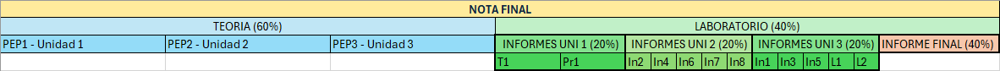

#  Diseño Biomecánico 2/2024

## Página de la asignatura

[uvirtual](https://uvirtual.usach.cl/moodle/course/view.php?id=37566)

## Horário 
- Lunes: bloques 2 y 3 (L2 y L3: 09:50 - 11:10 y 11:25 - 12:45), laboratorio de biomecanica
- Miércoles: bloque 6 (W6: 16:55 - 18:15), laboratorio de biomecanica

## Profesores

- Britam Gomez Arias (britam.gomez @usach.cl)
- Mauricio Fritz Vásquez
- Juliano Dawid Barboza (juliano.dawid @usach.cl)

## Resultados de Aprendizaje

Al finalizar el curso, los estudiantes serán capaces de integrar conocimientos teóricos y prácticos en el diseño, manufactura y certificación de dispositivos biomédicos. Podrán aplicar normativas y procesos de investigación, utilizar técnicas de manufactura aditiva y diseñar sistemas de actuadores eléctricos, culminando en la creación de un sistema electromecánico biomédico funcional.	

## Contribución al Perfil de Egreso

- DESEMPEÑOS INTEGRALES COMUNES	
    - Diseñar sistemas, componentes o procesos, considerando buenas prácticas, estándares y tecnologías pertinentes, así como variables económicas, ambientales, culturales y sociales.	
    - Nvl 4 - Aplicar criterios de buenas prácticas, estándares y tecnologías pertinentes, en el diseño de sistemas, componentes y procesos que respondan a problemáticas del ámbito de la ingeniería.	
    - Resolver problemas complejos desde la ingeniería, mediante soluciones integrales y de carácter multidisciplinario, aplicando los conocimientos de ciencias básicas, humanas, y de ingeniería, desde una perspectiva sistémica, con un enfoque innovador y orientado al emprendimiento.	
    - Indicador de logro: Nvl 3 - Integrar atributos de innovación y emprendimiento en la resolución de problemas de ingeniería, incorporando conocimiento de las ciencias básicas, humanas y de ingeniería desde una perspectiva sistémica y multidisciplinaria.	
- ELEMENTOS DEL SELLO INSTITUCIONAL	
    - Aprender de manera autónoma
    - Ejercer una función de liderazgo
    - Postura ética
    - Adaptabilidad
- ATRIBUTOS I+E
    - Comunicación
	- Trabajo grupal e individual
	- Trabajo Interdisciplinario/multidisciplinario
	- Ética y profesionalismo

## Evaluaciones

El curso se evalúa mediante 3 pruebas escritas que contemplaran las unidades temáticas. El promedio de las pruebas escritas corresponderán a un 60% de la nota final del curso. 

Además, los estudiantes deberán desarrollar 3 actividades prácticas y un proyecto final en grupos de 3 personas (máximo), las que serán evaluadas a través de la redacción de informes  (60% de la nota final del laboratorio) y una presentacion (40% de la nota final del laboratorio). Los laboratorios corresponderán a un 40% de la nota final del curso. 

La siguiente tabla muestra un resúmen de las notas

El estudiante debe aprobar todos los laboratorios (≥4.0). Si reprueba un laboratorio, tiene derecho a repetirlo 1 vez. Por cada dia de atraso en la entrega del informe escrito, se descontará 1 punto (inlcuyendo fin de semana y feriados). La no entrega de un informe de laboratorio será causal de reprobación.

El estudiante tendrá derecho a rendir una Evaluación Final que evaluará todos los contenidos del curso y que reemplazará la calificación más baja de las pruebas escritas. 

Para aprobar la asignatura, el estudiante debe asistir por lo menos a un 75% de las clases teóricas y a todas las actividades prácticas, caso contrario, reprobará la asignatura con nota final 3.5, independiente de las calificaciones obtenidas durante el semestre. 

Además, el estudiante debe aprobar la parte teórica del curso y práctica. Si por alguna razón, alguno de los promedios simples - Teoría o Laboratorio - es < 4.0, se reprobará la asignatura con la nota mínima de las dos secciones, independiente de las ponderaciones previamente indicadas. 

Si con la evaluación final incluida, el estudiante sigue teniendo nota final de alguna sección del curso (Teórico o Laboratorio) <4.0, reprobará el curso.

Respecto a las demás reglas de docencia, este curso se adscribe a las [DIRECTRICES DOCENCIA ING. CIVIL BIOMEDICA 2024](https://ingenieriabiomedica.usach.cl/sites/ing-civil-biomedica/files/directrices_docencia_ing._civil_biomedica_2024.pdf).

## Aprobación del Curso

El curso se aprueba con promedio final ≥4.0.	

## Programa de Actividades

[Calendario General](CALENDAR.md)

### Unidad 1: Sistemas mecanicos y electromecánicos biomédicos.

- ¿Que es un sistema electromecánico? 
- Sistemas biomédicos electromecánico (Robot, Exoesqueletos, Bombas de infusión, Camas reclinables, Ventiladores mecánicos, entre otros).

### Unidad 2: Diseño Mecánico

- ¿Que es el diseño mecánico industrial y para qué se usa?
- Principios de diseño mecánico
- Uso de Autodesk Fusion 360.
- Aplicaciones de diseño en dispositivos biomédicos.

### Unidad 3

- Introducción a actuadores ¿Qué son? ¿Para qué se usan?
- Tipos de actuadores y su uso en tecnología biomédica.
- Diseño y control de actuadores.
- Integración de actuadores en dispositivos biomédicos.

[Calendario Unidad 3](CALENDAR_UNIT_3md)

### Proyecto Final

Desde el inicio del curso se les pedirá a los estudiantes que implementen un sistema biomédico electromecánico (robot, bomba de infusión, prótesis electromecánica, ventilador mecánico, entre otros). El proyecto final comprende la generación de una presentación en que se demuestra todo el proceso de desarrollo e implementación a lo largo del curso.	
