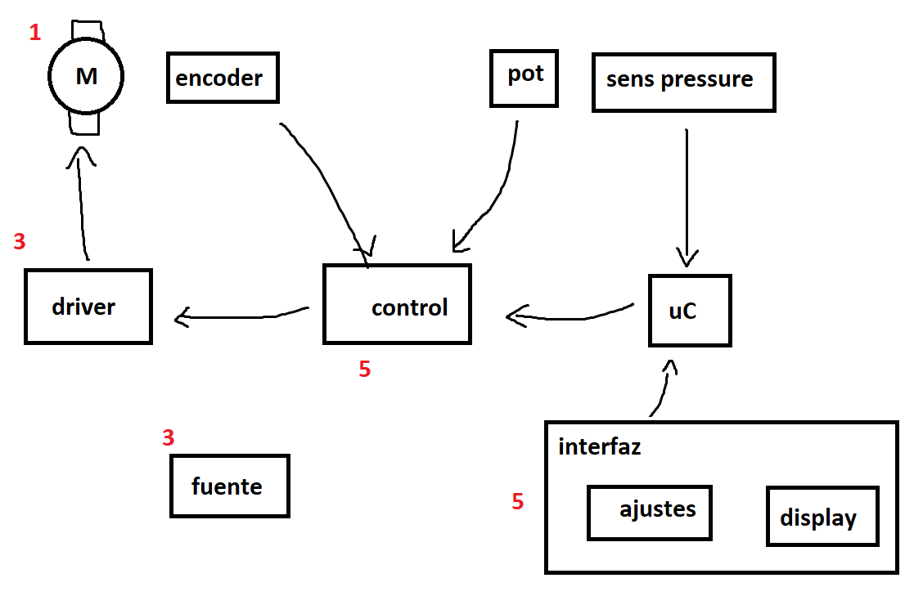

#  Unidad 3 de Diseño Biomecánico
# Informe 3

#### Segundo Semestre de 2024

## Introducción

Este semestre el proyecto final del curso corresponde al diseño e implementación de un ventilador mecanico de emergencia, similar al desarrollado por MIT: https://emergency-vent.mit.edu/ . La figura a continuación muestra un diagrama simplificado de las placas de circuito electrónico que componen el sistema:

En el primer informe se seleccionó el motor PG188 Gearmotor with 0.5 in. Hex Output de AndyMark, el mismo que se utilizó por el equipo del MIT. En este informe, el objetivo es seleccionar el driver y la fuente de poder.

1. Estudien las especificaciones del motor elegido y la pagina del ventilador de emergencia desarrollado por el MIT. Busquen drivers de motor que sean compatibles con el motor seleccionado y el uso que se requiere en esta aplicación. Generen una lista con al menos 3 opciones que contenga la siguiente información (3pt):

    1. Identificación del driver
    1. Corriente maxima
    1. Voltaje maximo
    1. Si es capaz de encender el motor en ambas direcciones
    1. Tienda donde se puede comprar
    1. Precio
    1. Estimación de plazo de entrega

    Al final del informe, entreguen una recomendación de cual driver creen que sería el mejor para este proyecto. 

2. Estudien las especificaciones del motor elegido y la pagina del ventilador de emergencia desarrollado por el MIT. Busquen fuentes de alimentación (AC/DC) que sean compatibles con el motor seleccionado y el sistema en general. Generen una lista con al menos 3 opciones que contenga la siguiente información (3pt):

    1. Identificación de la fuente
    1. Corriente maxima
    1. Voltaje nominal
    1. Tienda donde se puede comprar
    1. Precio
    1. Estimación de plazo de entrega

    Al final del informe, entreguen una recomendación de cual driver creen que sería el mejor para este proyecto. 

## Plazo de entrega: 23:59, 28 de Octubre de 2024