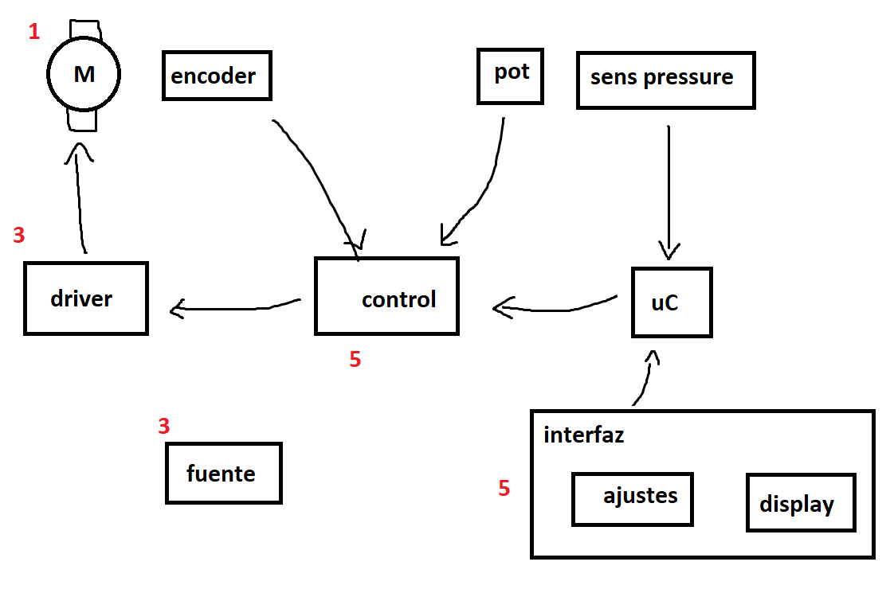

#  Unidad 3 de Diseño Biomecánico
# Informe 5

#### Segundo Semestre de 2024

## Introducción

Este semestre el proyecto final del curso corresponde al diseño e implementación de un ventilador mecanico de emergencia, similar al desarrollado por MIT: https://emergency-vent.mit.edu/ . La figura a continuación muestra un diagrama simplificado de las placas de circuito electrónico que componen el sistema:

 En este informe, el objetivo es diseñar las placas de control e interfaz. Estudien la placa de circuito impreso diseñada por el equipo del MIT, en especial las paginas sobre los componentes electronicos utilizados https://emergency-vent.mit.edu/controls/electrical-hardware/ y el circuito https://emergency-vent.mit.edu/controls/circuit-diagram/ . 
 
 1. Interfaz: Utilizando Fuzion 360, diseñen una placa que cumple con la misma función que la del MIT: integrar el arduino con los sensores y display. Pueden considerar los mismos componentes electronicos que en la solución del MIT:
    - 4 potenciometros para ajustar los parametros
    - 3 botones
    - 1 conector para el interruptor de limite de curso
    - 1 buzzer
    - 1 luz indicadora de error
    - 1 sensor de presión
    - 1 display (mismo modelo que MIT)
    - 1 conector a la fuente de 12 V
    - 1 regulador de voltaje de 5 V
    - 1 conector al sistema de control (roboclaw en el diseño del MIT)

    Posicionen los componentes en la placa de forma que facilite el ajuste y visualización de los controles y display. Realicen el ruteo conforme recomendaciones del profesor. Compartan el diseño online con el profesor. (3pt)

2. Control: En vez de comprar una placa que implementa el controlador del motor DC, se diseñará e implementará una placa customizada. Diseñen la placa de control (schematic & layout), teniendo en cuenta las siguientes consideraciones:
    - la placa debe tener conectores para recibir la alimentación de 5V, los comandos desde el arduino, la señal del encoder y del potenciometro de posición. Además, también tendrá un conector para enviar la señal de PWM al driver del motor (1pt)
    - la placa utilizará el microcontrolador ATTINY202-SSNR para implementar el algoritmo de control. Incluyan un conector para programarlo. Consulten el profesor sobre cuales pines se utilizarán para leer la señal del encoder y cual generará la señal de PWM (1pt)
    - además, se utilizará el CD74HCT112E para convertir las señales A y B del encoder en dos pulsos. Consulten el profesor sobre como conectarlo (1pt)

## Plazo de entrega: 23:59, 20 de Noviembre de 2024