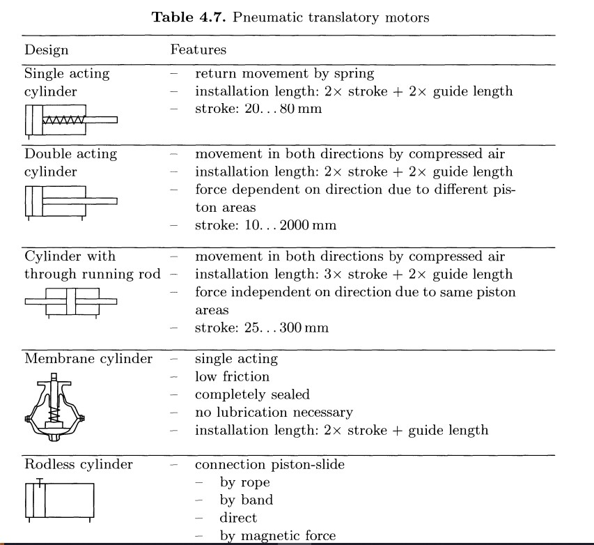
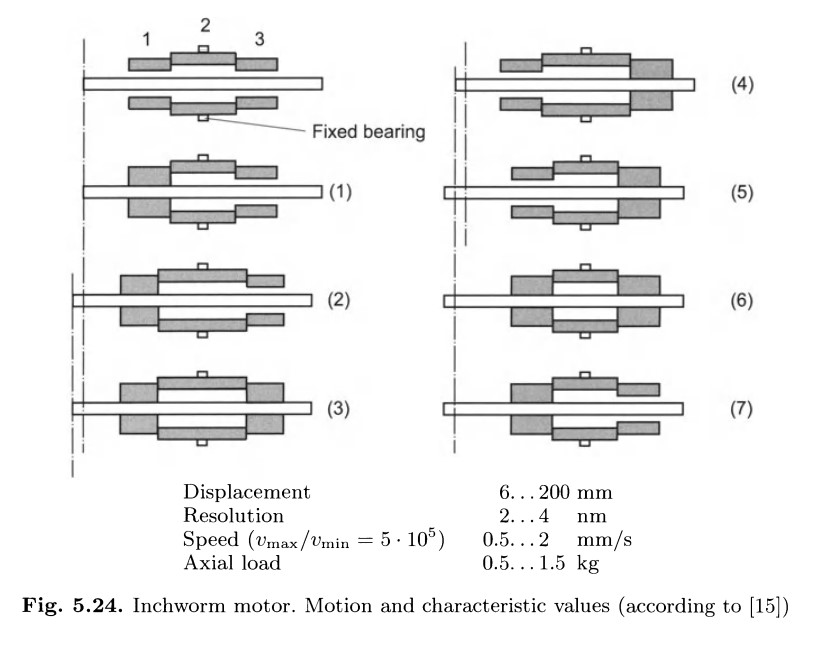
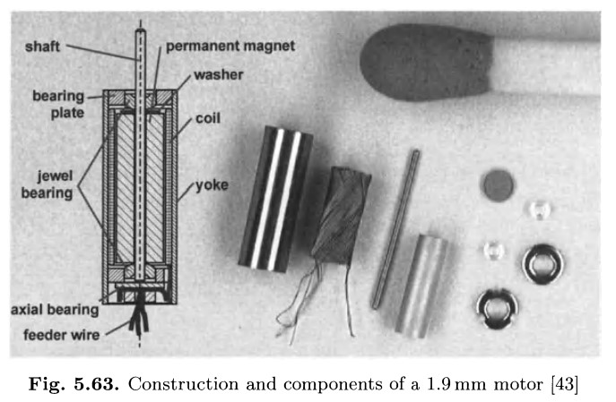

# 01 - Introducción

[Syllabus](../README.md)

## Proyecto Final

Ventilador de Emergencia basado en [AMBU](https://youtu.be/Faxy3JkCjWo?si=DyKWwp9gp1p2NFUi&t=266)

Similar a: [MIT Emergency Ventilator Project](https://emergency-vent.mit.edu/)

## Actuadores

Un actuador es un componente de una maquina que produce fuerza, torque o desplazamento. Se pueden clasificar de la siguiente forma:

- Actuadores
  - eléctricos
  - hidraulicos
  - neumaticos
  - no convencionales

Actuadores hidraulicos o neumaticos: valvulas proporcionales, de conmutación y motores

Acutadores no-convencionales: electroquímico, efecto térmico de memoria, **piezoelectrico**, magnetostricción, fluidos electrorreológicos, fluidos magnetorreológicos, **microactuadores**

### Actuadores Eléctricos

También conocidos como motores eléctricos, son componentes capaces de convertir energía eléctrica en energía mecanica. Suponiendo 100% de eficiencia:

$$Potencia\ Mecanica\ Entregada = Potencia\ Eléctrica\ Consumida$$

Para motores rotatorios:

$$T \omega = V I$$

O, si se considera un factor de eficiencia $\eta \leq 1$:

$$T \omega = \eta VI$$

Se pueden clasificar de la siguiente forma:

- Motores Eléctricos
  - Auto-conmutados
    - Conmutador mecanico
      - Estator Eléctrico
      - **Estator de imanes permanentes**
    - Conmutador electrónico
      - **Sin escobillas (brushless)**
      - Reluctancia variable
  - Conmutados externamente
    - Asíncrono
    - Síncrono
    - **Paso a paso**

### Motor DC (de imanes permanentes)

Parametros para selección: potencia, velocidad angular, torque

[ejemplo](https://hubot.cl/producto/motor-dc-3-14v-500tb-12560-sku-086m/)

Parametros:
- sin carga (no load)
- **nominal / maxima eficiencia**
- retención (stall)

Y si potencia está OK, pero no es la velocidad que necesito ?

### Transmisiones mecanicas

$$T_1 \omega_1 = T_2 \omega_2$$

[ejemplo con opciones](https://hubot.cl/producto/motorreductor-12v-alto-torque-55-kgcm-5-rpm-sku-1076/)

Diseño para velocidad/torque maximos, pero durante operación, como controlo el punto de operación ? Ejemplo: necesito la mitad de la velocidad con el mismo torque.

[Lab 1](../)

## Bibliografia

Janocha, Hartmut (2013). Actuators: Basics and Applications. Germany, Springer Berlin Heidelberg