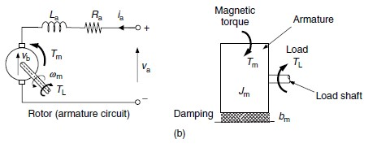

# Modelo del Motor DC

## Fuerza de Lorentz

Fuerza inducida en un conductor de largo l por odnde pasa una corriente i y un campo magnéctico B (el campo magnético es perpendicular al eje del conductor)

$$F = B i l$$

Vectorialmente, $\vec{F} = \vec{i l} \times \vec{B}$

En el caso de motores, se posiciona la corriente y el campo magnético de forma a producir un torque en el rotor:

Además, se conmuta la dirección de las corrientes conforme el rotor gira de tal forma que mantienen su dirección con respecto al plano de conmutación. Por ejemplo, en la figura del rotor arriba, las corrientes a la izquierda siempre tendrán la dirección de "entrar" en el plano de la pantalla, mientras las corrientes de la derecha tendrán la dirección de "salir" del plano de la pantalla.

De esta forma, en un motor DC el Torque producido es proporcional a la corriente:

$$T_m = k_t I$$

## Fuerza contraelectromotriz

Cuando un conductor de largo l se mueve con velocidad v perpendicular a un campo magnéctico B, se induce un voltaje en dicho conductor:

$$v_b = B l v$$

La dirección del voltaje es de tal forma que la fuerza de Lorentz, que se produciría si el voltaje generara una corriente, se opondría al movimiento (contraria a v).

En un motor, el voltaje inducido por el movimiento del rotor se opone al voltaje de alimentación, y es proporcional a la velocidad angular del motor:

$$v_b = k_v \omega$$

## Modelo eléctrico

$$v_a = R_a i_a + L_a \frac{di_a}{dt} + v_b$$

En estado estacionario:

$$v_a = R_a i_a + v_b$$

Reemplazando, $i_a$ por $T_m/k_t$ y $v_b$ por $k_v \omega$:

$$v_a = \frac{R_a T_m}{k_t} + k_v \omega$$

Que indica una relación lineal entre $\omega$ y $T_m$ cuando $v_a$ es constante. Es decir, una recta como la de la siguiente grafica:

También se puden calcular la corriente, potenica consumida, potencia generada y eficiencia con respecto al torque, obteniendo una grafica como la siguiente:

## Bibliografia

- de Silva, Clarence W. (2007). Sensors and Actuators: Control System Instrumentation. Estados Unidos, CRC Press.
  - Capitulo 7, sesiones 7.1 y 7.2.1