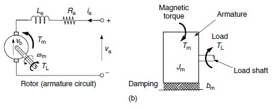

# Modelo del Motor DC II

## Modelo dinámico

parte eléctrica

$$v_a = R_a i_a + L_a \frac{di_a}{dt} + v_b$$

$$v_{tot} = v_a - v_b = R_a i_a + L_a \frac{di_a}{dt}$$

aplicando la transformada de laplace

$$v_{tot} = R_a i_a + L_a s i_a$$

$$\frac{i_a}{v_{tot}} = \frac{1}{L_a s +R_a} = \frac{1}{R_a}\frac{1}{\frac{L_a}{R_a}s+1}$$

es decir, la función de transferencia entre el voltaje y la corriente es una sistema del primer orden com constante de tiempo $\frac{L_a}{R_a}$.

para la parte mecânica:

$$T_{total} = J \frac{d \omega}{dt}$$

considerando que el torque total es el torque generado por el motor ($T_m$) menos el torque que resiste al movimiento, que lo podemos modelar como un torque generado por la ficción, que es proporcional a la velocidad ($b \omega$), obtenemos: 

$$T_m - b \omega = J \frac{d \omega}{dt}$$

aplicando la transformada de laplace y reordenando los términos: 

$$ \frac{\omega}{T_m} = \frac{1}{J s + b} = \frac{1}{b}\frac{1}{\frac{J}{b} s + 1} $$

es decir, la función de transferencia entre el torque motor y la velocidad angular es un sistema del primer orden con constante de tiempo $\frac{J}{b}$.

en conclusión, un primer modelo dinámico del motor sería que el voltaje aplicado genera una corriente a través de una función de trasferencia del primer orden con constante de tiempo $L_a / R_a$, luego la corriente produce un torque siguiendo $T_m = k_t i_a$,y finalmente el torque produce una velocidad angular a través de un sistema del primer orden con constante de tiempo $J / b$.

La constante de tiempo Eléctrica suele ser órdenes de grandeza menor que la mecánica, por lo que se espera que la dinámica del motor esté dominada por la constante de tiempo mecânica.

es decir, podemos aproximar el motor como un sistema de primer orden donde un voltaje de entrada produce una velocidad angular de salida con una constante de tiempo $J / b$.

este modelo es una buena aproximación, pero si se requiere un modelo más preciso es necesario incluir el efecto de la velocidad angular en $v_b$. La función de transferencia completa sería: 

$$\frac{\omega}{v_a} = \frac{k_t}{(L_a s + R_a)(J s + b) + k_v k_t}$$

## Bibliografia

- de Silva, Clarence W. (2007). Sensors and Actuators: Control System Instrumentation. Estados Unidos, CRC Press.
  - Capitulo 7, sesíon 7.3.2
