# Motores de paso-a-paso y brushless

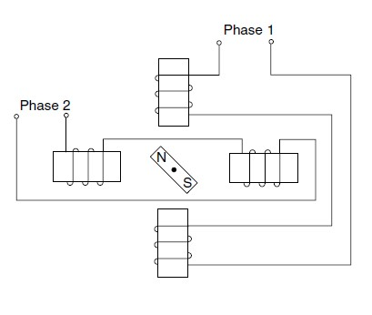

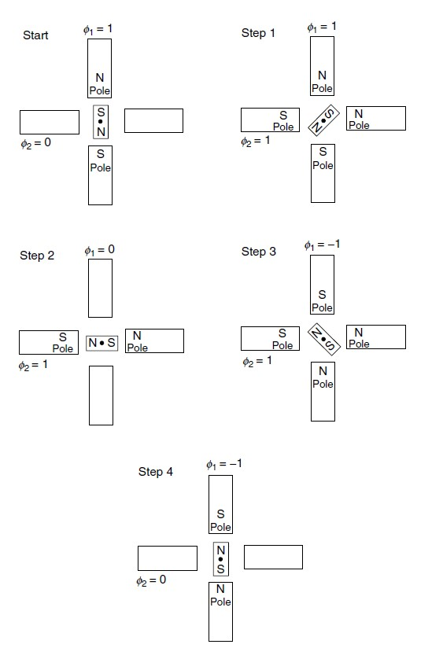

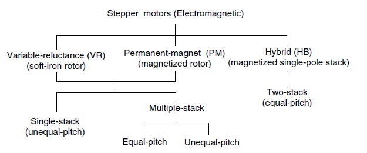

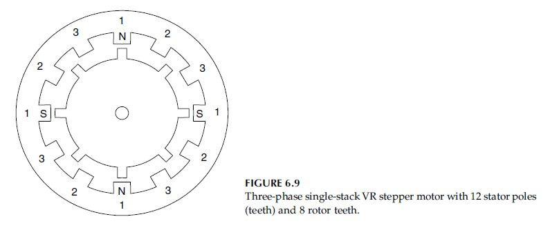

estator, rotor

unipolar, bipolar

$n_s, n_r, p$

$\theta_s = \frac{360°}{n_s}$

$\theta_r = \frac{360°}{n_r}$

$\Delta\theta = \theta_r - r \theta_s$, si $\theta_r >  \theta_s$

$\Delta\theta = \theta_s - r \theta_r$, si $\theta_s >  \theta_r$

$ r = \max \N | \Delta\theta >0$

para paso completo:

$\theta_r = p \Delta\theta$

$n_s = r n_r + \frac{n_s}{p}$, si $n_s > n_r$

$n_r = r n_s + \frac{n_s}{p}$, si $n_r > n_s$

paso: $n = \frac{360°}{\Delta\theta}$

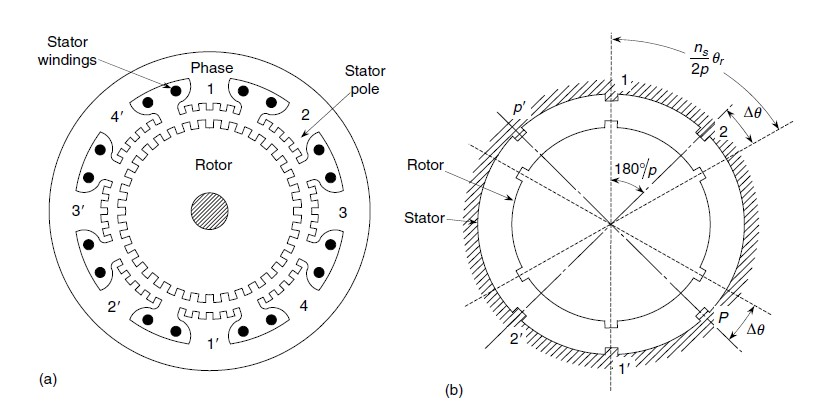

Driver

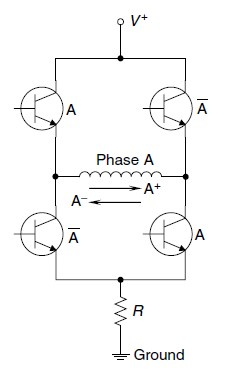

Jitter

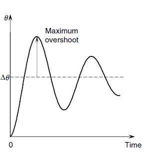

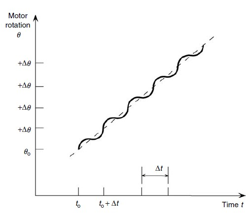

Error de posición

$\theta_e = \frac{p}{n}\sin^{-1} (\frac{T_L}{T_{max}})$

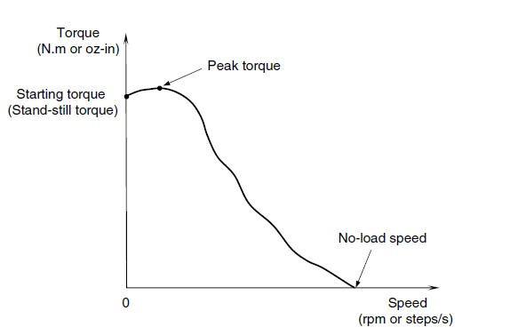

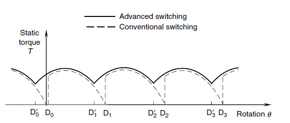

ejercicio pagina 463

energia: $KE = \frac{1}{2} mv^2 =  \frac{1}{2} J\omega^2$

fuerza: $F = m\frac{dv}{dt}$

torque: $T = J\frac{d\omega}{dt}$

transmisión: $T_1 \omega_1 = T_2 \omega_2$ o $T_1 \omega_1 = F_2 v_2$

## Brushless

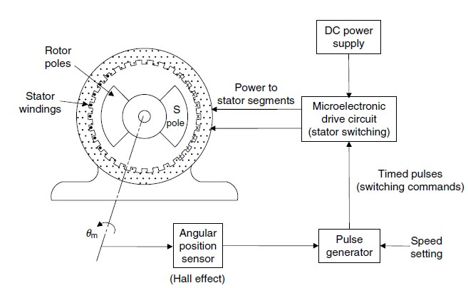

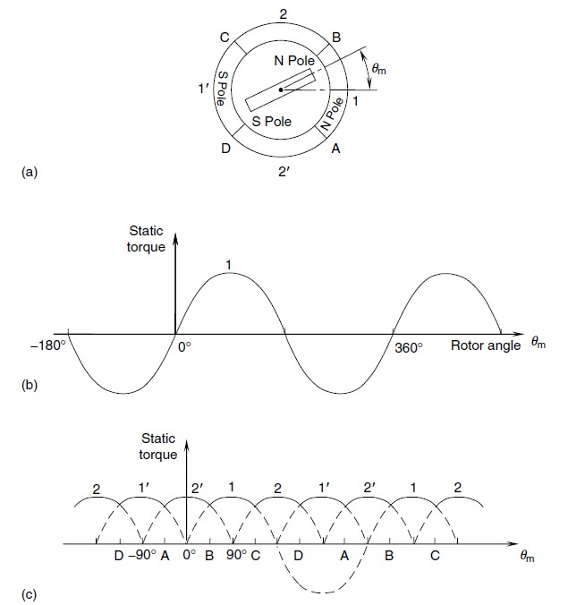

## Bibliografia

- de Silva, Clarence W. (2007). Sensors and Actuators: Control System Instrumentation. Estados Unidos, CRC Press.
  - Capitulo 6
  - Capitulo 7, sesión 7.1.4
